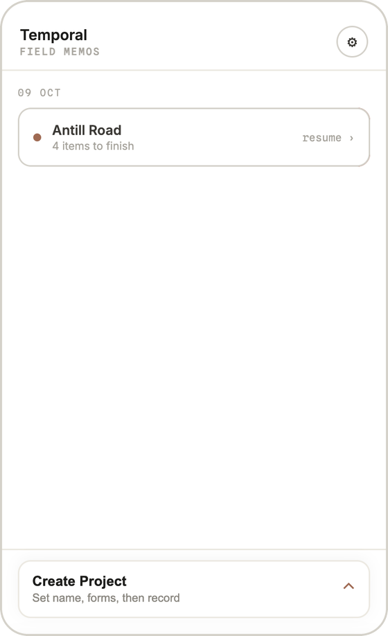
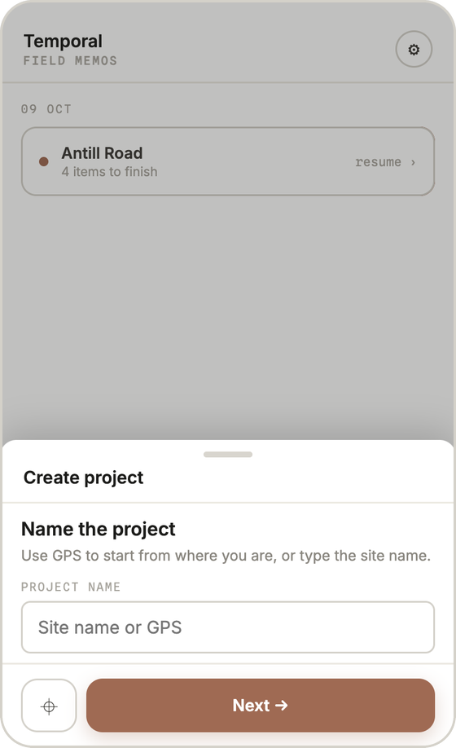
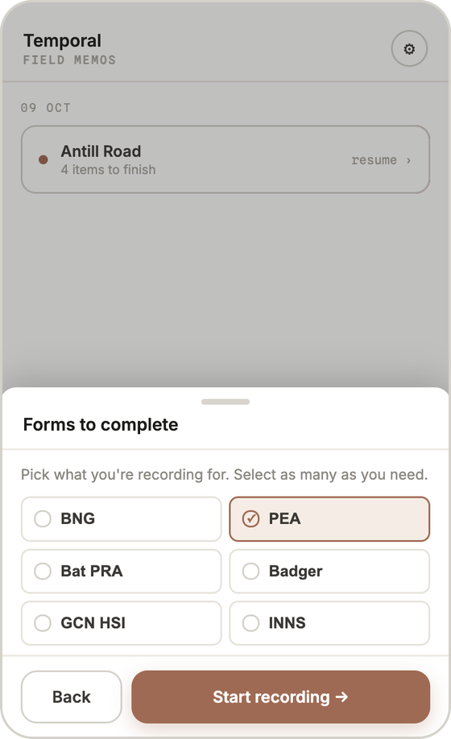
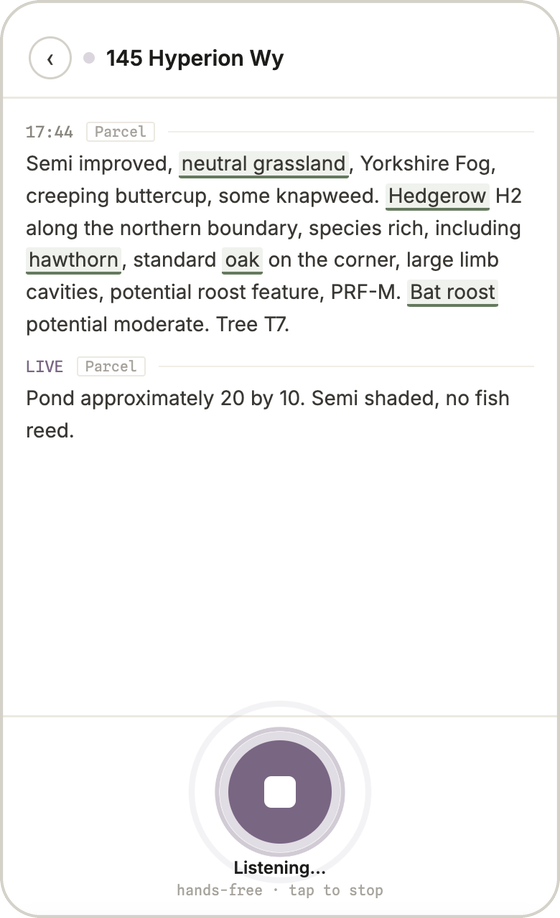
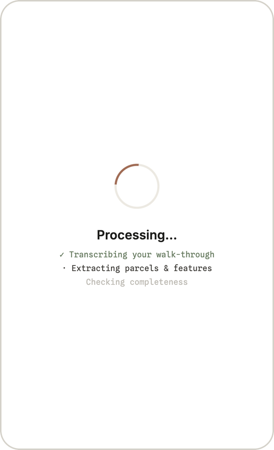
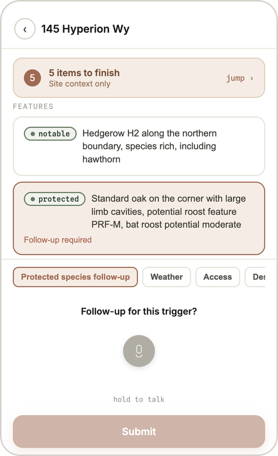

# Temporal

**Finish the site report before you leave the site.**

UK ecologists walk a site, scribble notes, take photos, then rebuild a Biodiversity Net Gain (BNG) or Preliminary Ecological Appraisal (PEA) report at 9pm. That's when they find the gaps: a hedgerow criterion never assessed, a bat roost with no follow-up. Fixing them means another drive back to site.

Temporal lets the surveyor talk while they walk. It turns the walk-through into the fields the report requires, then lists what they *didn't* say while they're still standing in the field.

Transcription is a commodity. The product is a **completeness check that knows the methodology**.

<table>
  <tr>
    <td align="center" width="33%"><br /><sub><b>Resume, don't restart.</b> Each site shows what's unfinished.</sub></td>
    <td align="center" width="33%"><br /><sub><b>Name it from GPS.</b> No typing on a muddy screen.</sub></td>
    <td align="center" width="33%"><br /><sub><b>One walk, many forms.</b> BNG, PEA, bat PRA share one recording.</sub></td>
  </tr>
  <tr>
    <td align="center"><br /><sub><b>Talk, hands-free.</b> Habitat and species terms light up live.</sub></td>
    <td align="center"><br /><sub><b>Speech becomes fields.</b> Parcels, features, site context.</sub></td>
    <td align="center"><br /><sub><b>Close the gaps on site.</b> Answer each by voice; the count drops.</sub></td>
  </tr>
</table>

## Product decisions

**Who it's for.** A surveyor outdoors, often one-handed, looking at a hedge rather than a phone. So: one button, two gestures (hold to talk, double-tap for hands-free), swipe up to finish. The transcript is the page.

**Trust over magic.** Every value carries the exact words it came from and a status: green (said outright), amber (inferred, check it), red (never said). The model proposes; the methodology checklist decides what's missing. Confidence comes from evidence, not a model's self-reported score.

**Hypothesis, not answer.** A desk study can pre-load parcels, but the field always wins. Overrides are one tap and keep the original as evidence.

### What we prioritised

- **Completeness checking** over transcription quality. It's the part no generic tool does.
- **Two habitats wired properly** (grassland, hedgerow) with real Natural England condition criteria, instead of all of UKHab done shallowly. The app only claims "complete" where it knows the method.
- **A guided demo site** with deliberate gaps, so the value lands in under two minutes.

### What we cut or deferred

| Cut | Why |
|---|---|
| Offline capture | Most UK sites have signal. The value is gap detection, not connectivity. |
| Native app / pocket recording | A PWA proves the loop; a native wrapper comes once it's validated. |
| Computing the statutory BNG score | Specialist tools own that. We capture field evidence that feeds it, labelled "field estimate, confirm at desk". |
| GIS import, photo capture, audit trail | Real needs, but none are required to prove the core moment. |
| Real Drive export | Stubbed behind an interface. The first customer's stack (likely Microsoft 365) decides the connector. |

### Tradeoffs

- **Depth vs breadth.** Two habitats done right beats forty done wrong. A false "complete" destroys trust faster than a missing habitat.
- **Live streaming vs batch.** Streaming feels instant but can fail mid-sentence, so a failed stream falls back to uploading the clip. No note is lost.
- **Swappable everything.** Speech (Deepgram), extraction (Claude) and storage sit behind interfaces with offline fakes. Slightly more structure up front; the whole app runs and tests with no API keys.

## Why it matters for ecologists

Since 2024, most English planning applications must show 10% Biodiversity Net Gain, so ecologists are doing more condition assessments than ever. Every return trip to site is a lost day. Every gap caught in QA is a report bounced back. Catching it on site, while memory is fresh, is where the time comes back.

## Beyond ecology

The pattern is **voice capture → structured form → methodology-aware gap check**. It fits any job where someone inspects in the field and writes it up against a standard later:

- **Building surveyors and property inspectors.** Condition reports, snagging lists.
- **Health and safety / fire risk assessors.** Regulated checklists where a missed item is a liability.
- **Insurance loss adjusters.** Claims evidence captured at the scene.
- **Utilities and infrastructure.** Asset inspections on poles, pipes, bridges.
- **Home care and community health.** Visit notes against a care-plan template.

Swap the vocabulary and criteria in `config/`, and the screens stay the same.

## Run it

```bash
npm install
cp .env.example .env.local
npm run dev        # http://localhost:3000
npm test
```

Runs fully offline by default with a scripted walk-through. For real speech and extraction, set `STT_PROVIDER=deepgram` + `DEEPGRAM_API_KEY` and `EXTRACT_PROVIDER=claude` + `ANTHROPIC_API_KEY`.

Built with Next.js, React 19, Deepgram and Claude. No database; visits live on the device.
