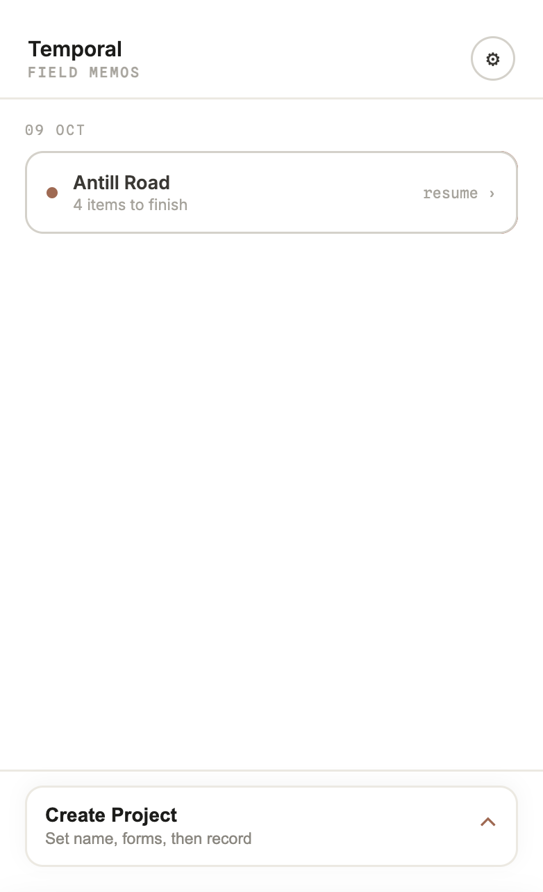
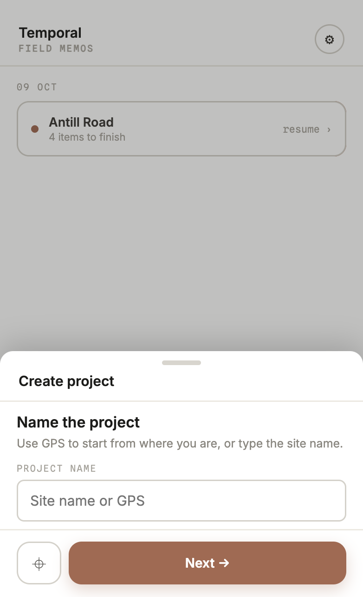
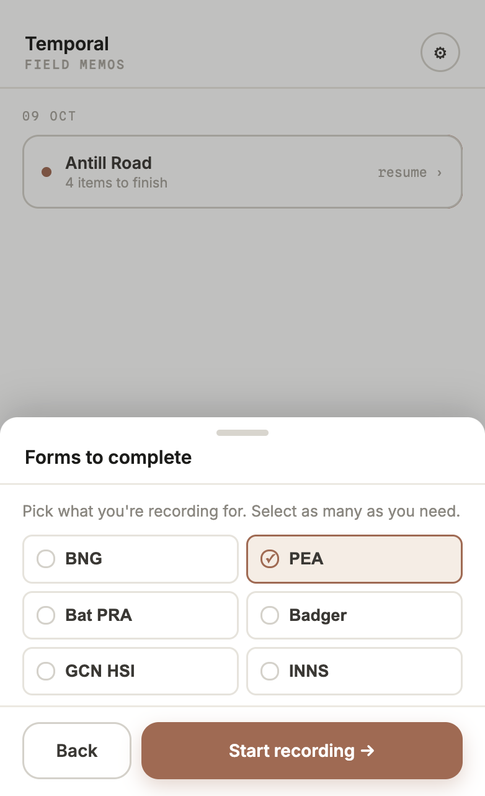
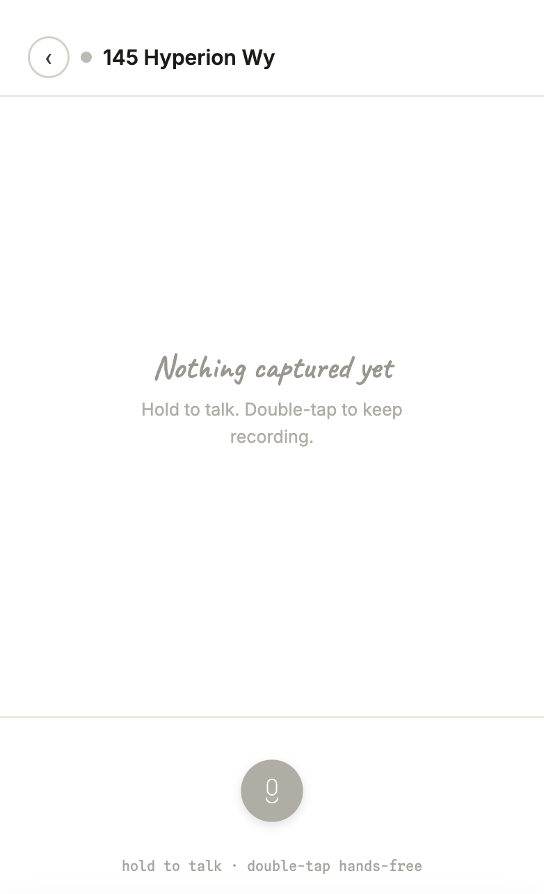
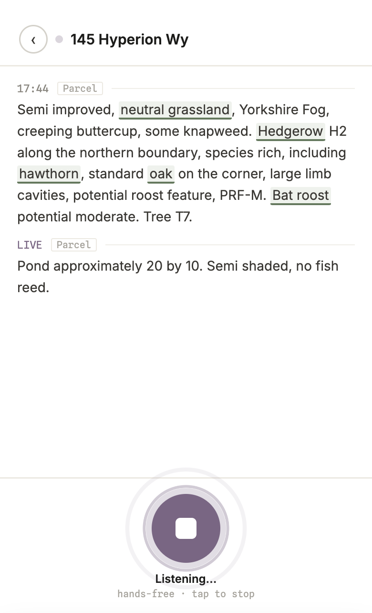
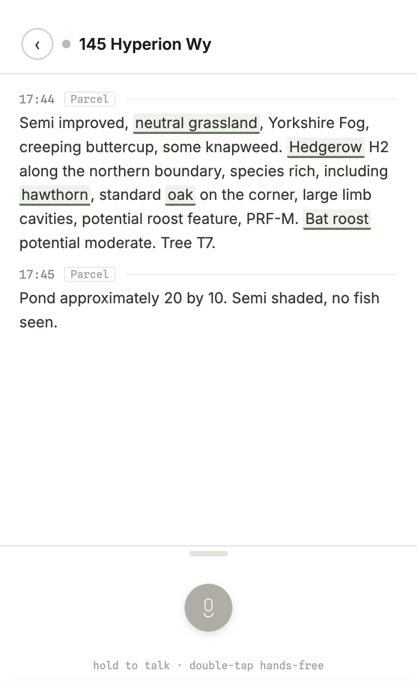
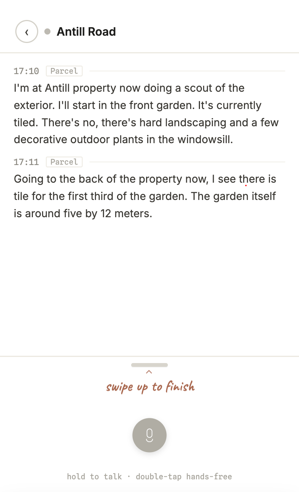
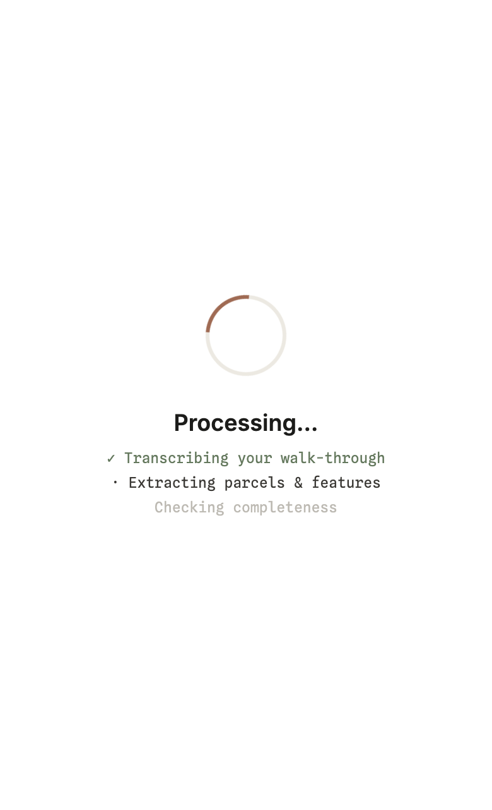
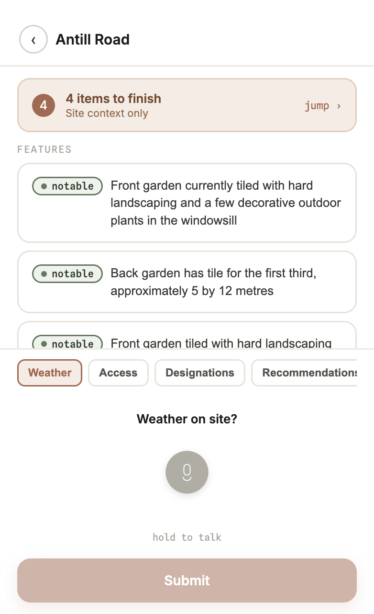
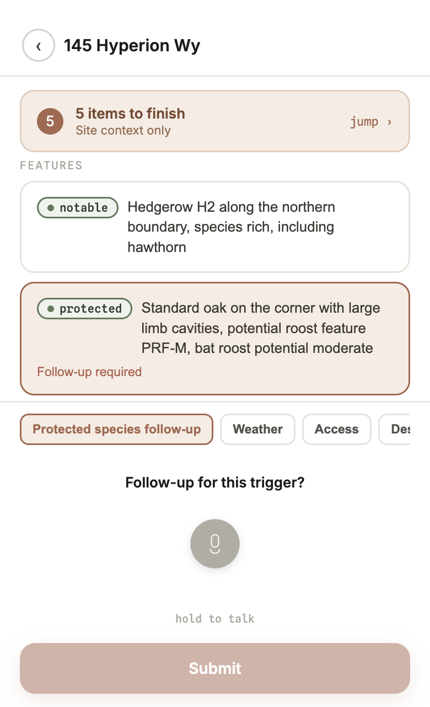

# Temporal

A field recorder for UK ecologists. You walk a site and talk. The app writes the notes down as you speak, turns them into the fields a Biodiversity Net Gain assessment or Preliminary Ecological Appraisal actually needs, and tells you what you forgot before you get back in the car.

Transcription is the easy part. The product is knowing the report is finished while you are still on site.



## The walk

A visit is one continuous gesture, not a form you fill in afterwards.

**Start a project from where you are standing.** Name the site, or let GPS fill it in from your location, then pick the forms this walk has to cover. BNG, PEA, bat preliminary roost assessment, and the rest ride on the same recording.

| Name the site | Choose the forms |
|---|---|
|  |  |

**Talk with your hands full.** Hold the mic to speak, release to keep the note. Double-tap and it stays on, so you can walk a hedgerow without watching the screen. Words appear while you are still talking, and domain terms — habitat types, species, protected-species triggers — light up as they land.

| Nothing captured yet | Listening, hands-free |
|---|---|
|  |  |

A finished note stays exactly as it looked. Double-tap the line to correct a word in place. On your first project, the screen tugs up twice to show how you leave: swipe up to finish the visit.

| Notes, with the vocabulary marked | Swipe up to finish |
|---|---|
|  |  |

**Leave with a report, not a recording.** Processing reads the walk-through and fills parcels, features, and site context. Review opens on what is still missing. Each gap can be answered by voice — weather, access, or the follow-up a protected-species trigger requires — and the count drops before you submit.

| Turning speech into fields | What you still have to say |
|---|---|
|  |  |

A protected-species note is not done when it is written down. If the model hears a potential bat roost, review asks for the follow-up while you can still see the tree.



## Why the interface is shaped this way

The surveyor is outdoors, often one-handed, often looking at a hedge rather than a phone. So the recorder is a single button with two gestures, the transcript is the page, and finishing the visit is a swipe instead of a menu. The first project teaches that swipe once. Later projects stay quiet.

Every captured value is three things: the value, the verbatim words it came from, and a status. Green was said outright. Amber was inferred and wants a look. Red was never said. The banner at the top of review is that status added up — outstanding fields, criteria not assessed, and protected-species triggers with no follow-up. The model proposes. The checklist decides.

## Audio

Live transcription is a streaming session, not a file you upload when you stop talking.

1. The browser records with `MediaRecorder` and emits short audio chunks while the mic is open.
2. `GET /api/stt/live` asks Deepgram for a 30-second grant. The long-lived API key stays on the server. The browser only receives a token that has to be valid at the moment the socket opens.
3. Chunks go over a WebSocket to Deepgram `nova-2` with interim results and the UKHab vocabulary passed as keywords, so "hawthorn" and "badger latrine" are more likely to come back right.
4. Interim text replaces itself as the hypothesis changes. Final utterances are appended. The line on screen is finals plus the current interim, with a caret, until you stop.
5. On stop, the committed text is highlighted and saved onto the visit. If the live socket never starts, the same clip is posted to `/api/transcribe` and transcribed in one shot, so a failed stream does not lose the note.

`STT_PROVIDER=fake` runs the identical screen against a scripted walk-through that reveals a word at a time. The UI, the gestures, and the tests do not need a Deepgram account.

The gestures themselves are pure functions: a hold past 200ms starts push-to-talk, a second tap inside the double-tap window latches hands-free, and a later tap stops it. Swipe-to-finish uses its own physics — upward travel is resisted, and a flick keeps moving after you let go — so a click-drag on a desktop trackpad does not stall halfway.

## From transcript to fields

Speech-to-text stops at words. The report needs habitat type, area, condition, and whether each criterion passed. That second step is a swappable extractor behind the same interface the speech provider uses.

- Notes are stored on the visit with a target: this parcel, the site, or a feature. The extractor sees the transcript and the desk-study priors, not a blob of text.
- `EXTRACT_PROVIDER=claude` calls Claude for structured output (habitat, area, condition, criteria, features). `fake` fills the same schema with a deterministic reading of the transcript, which is what tests and the offline demo use.
- `mergeExtraction` applies the patch. Confidence from the model becomes green, amber, or red. A desk-study habitat that the surveyor contradicts stays visible as evidence, it is not silently overwritten.
- Keyword highlighting is separate from the model. `highlightKeywords` is a longest-match tokenizer over `config/vocabulary.json`, so the green underlines in the transcript are the domain vocabulary, not a guess.

Condition scoring is real for the habitats that are wired (grassland and hedgerow). The rest of UKHab is config waiting to be filled in, which keeps the triage honest: the app only claims completeness where it knows the method.

## Shape of the code

Next.js App Router, everything on the device. There is no database. Visits live in `localStorage` behind a repository, so a screen never touches storage directly. Speech and extraction are chosen in `lib/stt/factory.ts` and `lib/extract/factory.ts`. Changing provider does not change the record or review screens.

Navigation keeps the phone frame mounted and crossfades the page inside it. A visit layout waits until storage has loaded before it will say a project is missing, so review does not flash empty on the way in.

```
lobby → record → processing → review → export
         │            │              │
         │            └─ extract ────▼
         │                         merge into Field<T>
         └─ live STT ──────────── transcript notes
```

Google Drive on the export screen is a stand-in. The connection is stored locally so the end of the loop can be demonstrated. The real OAuth destination is the next milestone.

## Run it

```bash
npm install
cp .env.example .env.local
npm run dev
```

Open [http://localhost:3000](http://localhost:3000).

| Variable | Values | What it does |
|---|---|---|
| `STT_PROVIDER` | `fake` (default), `deepgram` | Scripted live transcript, or Deepgram streaming |
| `DEEPGRAM_API_KEY` | | Required for `deepgram`. Needs permission to mint a short-lived grant |
| `EXTRACT_PROVIDER` | `fake` (default), `claude` | Deterministic field fill, or Claude structured output |
| `ANTHROPIC_API_KEY` | | Required for `claude` |

Leave `DEEPGRAM_ALLOW_BROWSER_LIVE` unset. It exists so a local key that cannot mint grants can still open a socket on your own machine. A deployed demo should only ever hand out the short-lived grant.

```bash
npm test        # Vitest. Logic in lib/ and the API routes. No browser.
npm run build   # Typecheck and production build
```
